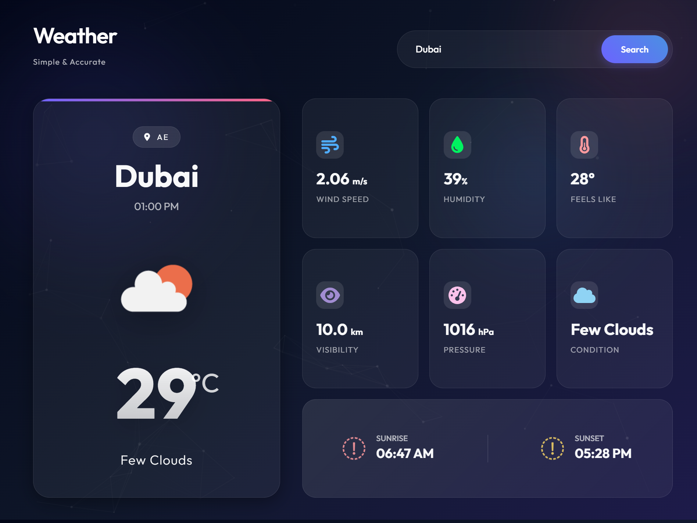

# Weather



Weather is a sleek, full-screen Flask app delivering real-time updates and detailed analytics worldwide. Featuring a stunning glassmorphism UI with dynamic backgrounds and smooth animations, it offers a premium user experience. Open-source, simple, and accurate—perfect for developers exploring modern web design.

## Features

-   **Real-Time Weather Data**: Accurate temperature, humidity, wind speed, and more.
-   **Global Coverage**: Search for weather in any city around the world.
-   **Modern UI**: Glassmorphism design with a dark theme and vibrant gradients.
-   **Responsive Layout**: Looks great on all devices, from desktops to mobiles.
-   **Dynamic Animations**: Subtle background animations and smooth transitions.

## Installation

1.  Clone the repository:
    ```bash
    git clone https://github.com/yourusername/weather-app.git
    cd weather-app
    ```

2.  Install dependencies:
    ```bash
    pip install -r requirements.txt
    ```

3.  Set up your API key:
    -   Get an API key from [OpenWeatherMap](https://openweathermap.org/).
    -   Open `app.py` and replace `API_KEY` with your key.

## Usage

1.  Run the application:
    ```bash
    python app.py
    ```

2.  Open your browser and navigate to `http://127.0.0.1:5010`.

## Contributing

Contributions are welcome! Please feel free to submit a Pull Request.

## License

This project is open source and available under the [MIT License](LICENSE).
